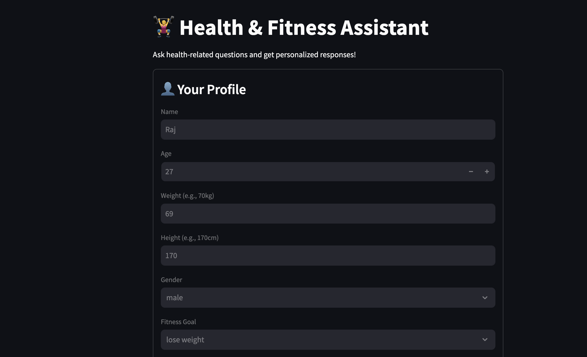

# 🏋️‍♂️ Health & Fitness Assistant (LLM-based Chatbot)

This is a personalized **health and fitness assistant** built using **Streamlit**, **LangChain**, and multiple **LLM providers** like **OpenAI**, **Groq**, and **HuggingFace**. It provides expert fitness, nutrition, and health advice based on the user's profile.

---

## ✨ Features

- 🔄 Choose from different LLMs: OpenAI, Groq (Mixtral/LLaMA), HuggingFace
- 🎯 Personalized advice based on:
  - Age, Weight, Height, Gender
  - Fitness Goals
  - Dietary Preferences
- 💬 Natural language Q&A
- 🧠 Prompt-engineered for high-quality, structured responses
- ⚡ Fast and interactive UI built with **Streamlit**

---

## 📸 Demo Screenshot



---

## 🚀 Getting Started

### 1. Clone the Repository

```bash
git clone https://github.com/aadityapritam001/Health_And_Fitness_Assistance.git
cd health-fitness-assistant
```

### 2. Install Dependencies
Create a virtual environment (optional):
```bash
python -m venv venv
source venv/bin/activate  # On Windows: venv\Scripts\activate

Then install:

pip install -r requirements.txt

### 3. Set API Keys
Set your API keys in environment variables (e.g., .env or system env):

export OPENAI_API_KEY=your-key
export GROQ_API_KEY=your-key

### 4. Run the App
streamlit run app.py
```
